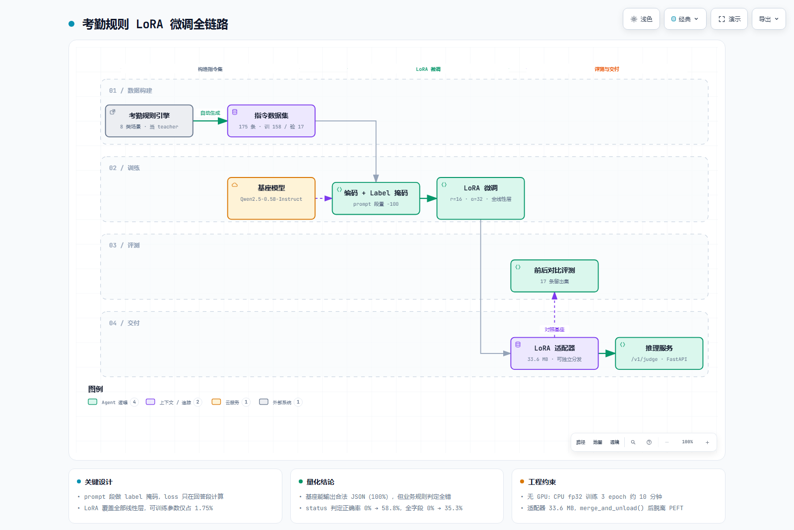

# 考勤规则指令微调（LoRA / Qwen2.5-0.5B）

> 用现有规则引擎当 teacher 自动生成指令数据，把「确定性规则判定」迁移成「模型泛化判断」，
> 并在**无 GPU** 环境下跑通完整链路：数据生成 → 编码掩码 → 微调 → 前后评测 → 权重合并 → 服务化。

**这不是一个玩具 demo，是一次有对照、有量化结论的完整实验。**

---

## 一、为什么要做

公司考勤规则原本是硬编码的规则引擎：上班打卡 08:30 前、下班 17:30 后、跨天班次、重复打卡、缺卡、审批补卡等等，
每条规则都要手写，遇到没覆盖的情况就失效。

问题是：**规则能穷举，但自然语言描述的情况不能**。

所以做了这件事：让规则引擎当 teacher 自动生成指令数据，把它的判定能力蒸馏进一个小模型，
看模型能不能学到规则背后的泛化逻辑。

---

## 二、效果（17 条留出集，同一份数据，前后对比）

| 指标 | 基座 Qwen2.5-0.5B-Instruct | LoRA 微调后 | 变化 |
|---|:---:|:---:|:---:|
| JSON 可解析率 | 100.0% | 100.0% | — |
| `status` 判定正确率 | **0.0%** | **58.8%** | +58.8pp |
| 分钟数字段正确率 | 29.4% | 35.3% | +5.9pp |
| 全字段整体正确率 | **0.0%** | **35.3%** | +35.3pp |

### 这条结论比数字更重要

> **基座模型能输出格式完全合法的 JSON（100%），但业务规则判定全错。**

也就是说：**格式遵从靠 prompt 就能拿到，业务规则必须靠微调。**

很多人用 few-shot 让小模型输出 JSON 以为就完事了，实际上模型只是在模仿格式，对业务规则一无所知。
这个前后对比把这个区别暴露得很清楚。

---

## 三、链路

```
考勤规则引擎（teacher）
        │  自动生成
        ▼
指令数据集 175 条（训 158 / 验 17）· 8 类场景
        │
        ▼
编码 + Label 掩码（prompt 段置 -100，只在回答段算 loss）
        │
        ▼
LoRA 微调（r=16 / α=32 / 全线性层 / CPU fp32 / 3 epoch ≈ 10 min）
        │
        ▼
适配器 33.6 MB ──┬──► merge_and_unload() ──► 独立权重（脱离 PEFT）
                 │
                 └──► 动态加载 ──► FastAPI /v1/judge
        │
        ▼
前后对比评测（17 条留出集）
```



> 可缩放 / 可导出 SVG 的交互版本：[`docs/lora-pipeline.workflow.html`](docs/lora-pipeline.workflow.html)

---

## 四、关键设计取舍

### 为什么用 LoRA（而不是全量微调）

不是因为 LoRA 更先进，是因为**只有 LoRA 能在这个环境跑起来**。

本机 `torch 2.13.0+cpu`，`cuda.is_available() = False`。0.5B 模型全量微调需要：
权重 2 GB + 梯度 2 GB + Adam 状态 4 GB ≈ 8 GB，而可用内存只有 9.2 GB，跑不动。

LoRA 只训练 1.75% 的参数，把梯度与优化器状态的开销压到可接受范围。

### 可训练参数 8.79M 是怎么算出来的（1.75%）

每个 LoRA 模块参数量 = `r × (in_dim + out_dim)`：

| 模块 | 计算 | 参数量 |
|---|:---:|---:|
| `q_proj` | 16 × (896 + 896) | 28,672 |
| `k_proj` | 16 × (896 + 128) | 16,384 |
| `v_proj` | 16 × (896 + 128) | 16,384 |
| `o_proj` | 16 × (896 + 896) | 28,672 |
| `gate_proj` | 16 × (896 + 4864) | 92,160 |
| `up_proj` | 16 × (896 + 4864) | 92,160 |
| `down_proj` | 16 × (4864 + 896) | 92,160 |
| **单层小计** | | **366,592** |
| **× 24 层** | | **8,798,208** |

占模型总参数 502,830,976 的 **1.75%**。

> 注意 `k_proj` / `v_proj` 的 out 是 128 不是 896：Qwen2.5-0.5B 用的是 **GQA（分组查询注意力）**，
> 14 个 query 头共享 2 个 KV 头（7:1），所以 KV 投影的输出维度是 `2 × 64 = 128`。

### 为什么要对 prompt 段做 label 掩码

只让模型学「怎么答」，不学「怎么问」。

- 输入是给定的，学它没意义；
- 不 mask 的话，loss 被大量输入 token 稀释，回答部分的梯度信号变弱，收敛慢且不稳定。

实现上把 prompt 段的 label 置为 `-100`，`CrossEntropyLoss` 默认 `ignore_index=-100` 会自动跳过。

### 为什么覆盖全部线性层而不只是 q、v

只调 q、v 是常见的省参数做法，但 **MLP 层（gate/up/down）承载了大量"知识"**。
规则判定任务要改的是判断逻辑，不只是注意力模式，所以七个线性层全覆盖。

---

## 五、快速开始

```bash
# 1. 生成指令数据集（用规则引擎当 teacher）
python scripts/gen_dataset.py          # → data/train.jsonl (158) + data/valid.jsonl (17)

# 2. 基座模型冒烟测试（确认能加载、能生成）
python scripts/smoke_test.py

# 3. LoRA 微调（CPU fp32，3 epoch 约 10 分钟）
python scripts/train_lora.py           # → out/lora-attendance/

# 4. 前后对比评测（17 条留出集）
python scripts/eval_lora.py

# 5. 合并权重，脱离 PEFT 独立部署
python scripts/merge_lora.py           # → out/qwen2.5-0.5b-attendance-merged/

# 6. 起推理服务
python scripts/serve.py --selftest     # POST /v1/judge
```

依赖：`torch` `transformers` `peft` `trl` `fastapi` `uvicorn`
模型：`Qwen/Qwen2.5-0.5B-Instruct`（HuggingFace 自动下载，未包含在本仓库）

---

## 六、已知局限（诚实写在这里）

1. **留出集只有 17 条**。结论只能说明方向，不足以做统计显著性判断。要坐实需要扩到 100+ 条并做多次随机划分。
2. **没有做 r 的消融实验**。r=16 是经验取值，没对比过 r=8 / 32。
3. **全字段正确率（35.3%）明显低于 status 正确率（58.8%）**。
   原因是两类任务难度不同：`status` 是分类，迟到分钟数是数值回归，数值预测对 0.5B 模型难得多。
   工程上的改进方向是**把数值计算下沉回规则引擎，让模型只做它擅长的分类判断**。
4. 训练时长「约 10 分钟」是事后估算，无独立计时记录。

---

## 七、目录

```
llm-lab/
├── scripts/
│   ├── gen_dataset.py    # 规则引擎 → 指令数据集（8 类场景 175 条）
│   ├── smoke_test.py     # 基座冒烟：加载耗时、参数量、CPU 吞吐
│   ├── train_lora.py     # LoRA 微调（含 prompt 段 label 掩码）
│   ├── eval_lora.py      # 微调前后四指标对比
│   ├── merge_lora.py     # merge_and_unload() 合并权重
│   └── serve.py          # FastAPI /v1/judge 推理服务
├── data/
│   ├── train.jsonl       # 158 条
│   └── valid.jsonl       # 17 条
├── docs/
│   └── lora-pipeline.workflow.html   # 链路架构图（可交互）
└── README.md
```

> `models/` 与 `out/` 未纳入版本控制（模型权重与适配器体积过大），按上面的步骤本地生成即可。

---

## License

MIT
